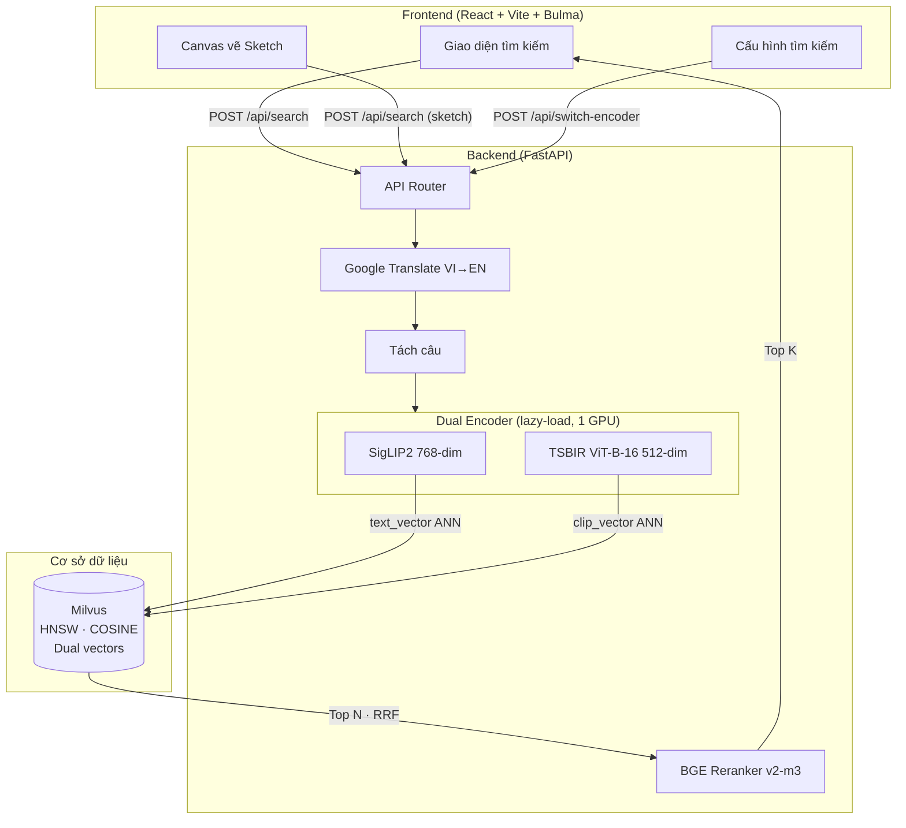
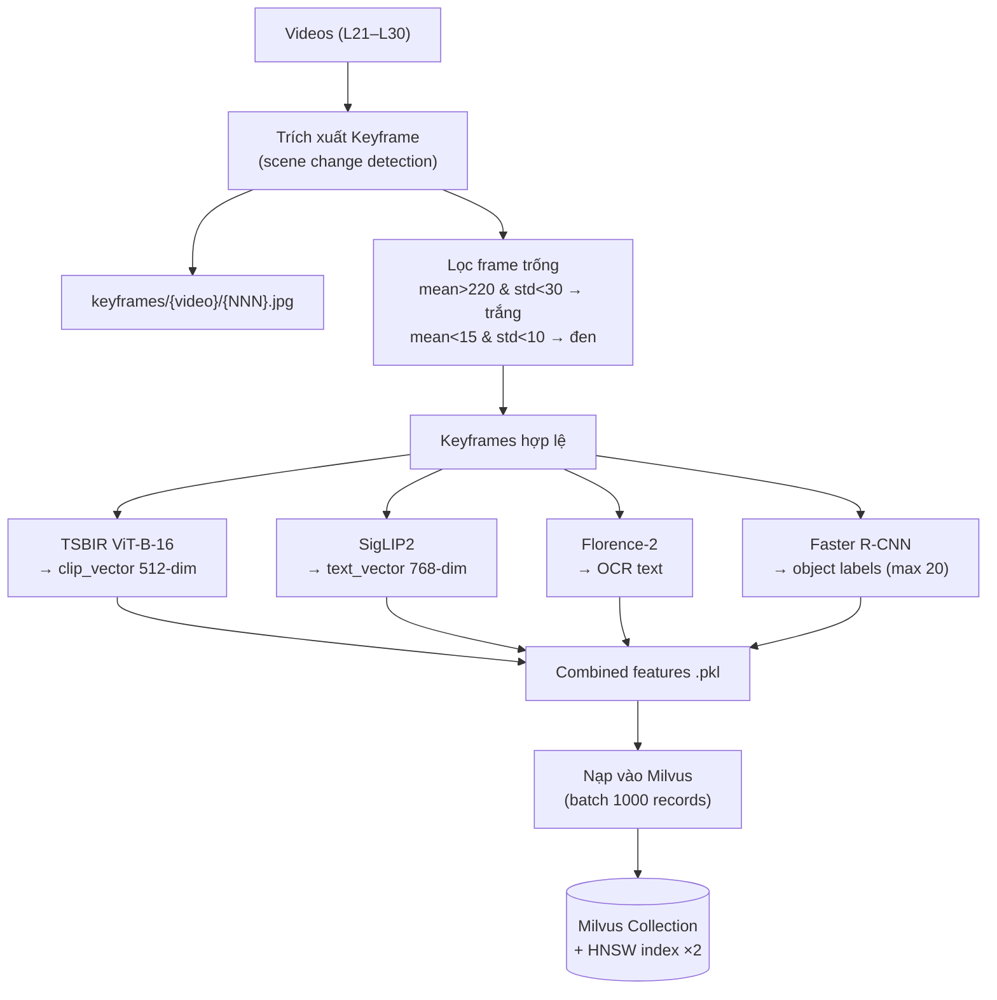
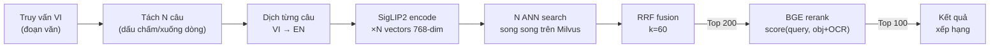
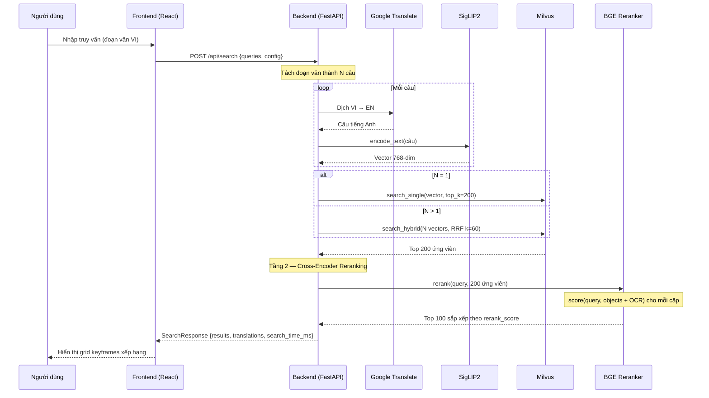

# Kiến trúc chi tiết — Hệ thống truy xuất video đa phương thức

> Tài liệu kỹ thuật bổ sung cho báo cáo chính và slide thuyết trình.

---

## 1. Tổng quan hệ thống

Hệ thống gồm ba lớp:

| Lớp | Công nghệ | Vai trò |
|---|---|---|
| **Frontend** | React + Vite + Bulma CSS | Giao diện tìm kiếm: nhập truy vấn text/sketch, hiển thị kết quả grid, lightbox xem ảnh |
| **Backend** | FastAPI (Python) | API server: dịch thuật, encode, tìm kiếm vector, reranking |
| **Storage** | Milvus (Docker) | Cơ sở dữ liệu vector với HNSW index, lưu dual vectors + metadata |



*Source: [docs/diagrams/architecture.mmd](diagrams/architecture.mmd)*

---

## 2. Dual Encoder — Thiết kế và lý do

### 2.1 Tại sao hai encoder?

Hai loại truy vấn yêu cầu hai không gian embedding khác nhau:

| Loại truy vấn | Encoder | Trường Milvus | Chiều | Lý do |
|---|---|---|---|---|
| **Text** (đoạn văn VI) | SigLIP2 | `text_vector` | 768 | Sigmoid loss cho text-image alignment tốt hơn CLIP |
| **Sketch** (vẽ tay) | TSBIR ViT-B-16 | `clip_vector` | 512 | Fine-tuned cho text-sketch-based image retrieval |

### 2.2 Lazy-load pattern

Chỉ **một encoder chiếm GPU** tại một thời điểm. Khi chuyển encoder:

```
SigLIP2 đang hoạt động
  → POST /api/switch-encoder {mode: "tsbir"}
    → SigLIP2.unload() — giải phóng GPU memory
    → TSBIR._load() — load model vào GPU
  → TSBIR sẵn sàng
```

Cơ chế `_load()` / `unload()`:
- `_load()`: Load checkpoint từ disk, chuyển lên GPU, warmup với dummy input
- `unload()`: Xóa model khỏi GPU, gọi `torch.cuda.empty_cache()`
- Load từ **local cache** (không cần internet) — tránh lỗi SSL certificate

### 2.3 SigLIP2 — Text encoder chính

| Thuộc tính | Giá trị |
|---|---|
| Model | `google/siglip2-base-patch16-512` |
| Chiều output | 768 |
| Huấn luyện | Sigmoid loss (không cần softmax normalization) |
| Input | Text (tiếng Anh, sau khi dịch từ tiếng Việt) |
| Output | L2-normalized embedding 768-dim |

SigLIP2 vượt trội CLIP cho text retrieval nhờ:
- **Sigmoid loss**: Mỗi cặp (text, image) được scoring độc lập, không cần batch negatives
- **Patch-level attention**: Nắm bắt chi tiết thị giác cục bộ
- **Tập huấn luyện lớn hơn**: WebLI dataset

### 2.4 TSBIR ViT-B-16 — Sketch encoder

| Thuộc tính | Giá trị |
|---|---|
| Model | `open_clip` ViT-B-16 + TSBIR checkpoint |
| Chiều output | 512 |
| Input | Sketch image (canvas frontend) hoặc ảnh thật |
| Output | L2-normalized embedding 512-dim |

TSBIR (Text-Sketch-Based Image Retrieval) được fine-tune để encode cả text lẫn sketch vào cùng không gian visual. Hữu ích khi người dùng nhớ bố cục hình ảnh nhưng không thể mô tả bằng lời.

---

## 3. Pipeline dữ liệu offline



*Source: [docs/diagrams/data-pipeline.mmd](diagrams/data-pipeline.mmd)*

### 3.1 Bốn bộ trích xuất đặc trưng

Chạy **song song** trên mỗi keyframe:

1. **TSBIR ViT-B-16** — Encode ảnh → `clip_vector` (512-dim, COSINE)
2. **SigLIP2** — Encode ảnh → `text_vector` (768-dim, COSINE)
3. **Florence-2** (`microsoft/Florence-2-base`) — OCR: trích xuất mọi text nhìn thấy trong frame (biển hiệu, logo, phụ đề, banner)
4. **Faster R-CNN** (`inception_resnet_v2`, OpenImagesV4) — Phát hiện đối tượng: top 20 labels có confidence ≥ 0.3

### 3.2 Lọc frame trống (blank frame filtering)

Video tin tức chứa nhiều frame chuyển cảnh (transition) — toàn trắng hoặc toàn đen. Những frame này không có nội dung ngữ nghĩa và gây nhiễu kết quả tìm kiếm.

Tiêu chí lọc:
- **Frame trắng**: mean pixel > 220 VÀ std < 30
- **Frame đen**: mean pixel < 15 VÀ std < 10

### 3.3 Nạp vào Milvus

Dữ liệu nạp theo batch 1000 records. Hai trường vector được index riêng bằng HNSW:

| Tham số HNSW | Giá trị |
|---|---|
| `M` | 32 |
| `efConstruction` | 256 |
| `metric_type` | COSINE |
| `ef` (search) | 512 |

---

## 4. Schema Milvus

```
Collection: keyframes
├── id           VARCHAR(32)     PK
├── video_name   VARCHAR(16)
├── keyframe_idx INT32
├── frame_idx    INT64
├── pts_time     FLOAT
├── fps          FLOAT
├── clip_vector  FLOAT_VECTOR(512)   ← HNSW COSINE
├── text_vector  FLOAT_VECTOR(768)   ← HNSW COSINE
├── objects      ARRAY<VARCHAR>(20)
└── ocr          VARCHAR(4096)
```

**Giải thích các trường:**
- `id`: `{video_name}_{keyframe_idx}` — khóa chính
- `clip_vector`: Embedding TSBIR cho sketch search
- `text_vector`: Embedding SigLIP2 cho text search
- `objects`: Nhãn đối tượng Faster R-CNN (vd: `["Person", "Car", "Building"]`)
- `ocr`: Toàn bộ text OCR từ Florence-2 (vd: `"THỜI SỰ VTV 19H"`)

---

## 5. Pipeline truy xuất hai tầng



*Source: [docs/diagrams/two-tier.mmd](diagrams/two-tier.mmd)*

### 5.1 Tầng 1 — Dense retrieval với tách câu

**Bước 1: Tách câu.** Truy vấn tiếng Việt thường là đoạn văn nhiều câu. Tách tại:
- Dấu chấm theo sau bởi khoảng trắng: `(?<=\.)\s+`
- Xuống dòng: `\n+`
- Bỏ câu ngắn hơn 10 ký tự

**Bước 2: Dịch.** Mỗi câu được dịch VI→EN qua Google Translate.

**Bước 3: Encode.** SigLIP2 encode mỗi câu thành vector 768-dim.

**Bước 4: ANN search.** N vectors → N lần tìm kiếm song song trên Milvus.

**Bước 5: RRF fusion.** Hợp nhất N danh sách kết quả:

$$\text{RRF}(d) = \sum_{i=1}^{N} \frac{1}{k + \text{rank}_i(d)}, \quad k = 60$$

RRF ưu tiên document xuất hiện ở top trong **nhiều** danh sách kết quả. Điều này cho phép mỗi câu đóng góp vào điểm cuối cùng — câu mô tả "4 phi hành gia mặc đen" match khía cạnh thị giác khác với câu "nghiên cứu cực quang".

### 5.2 Tầng 2 — Cross-encoder reranking

**Mô hình:** `BAAI/bge-reranker-v2-m3` (568M params)

**Input:** Với mỗi ứng viên:
- **Query**: toàn bộ truy vấn gốc (không tách câu)
- **Document**: `objects_text + " " + ocr_text`

**Output:** Điểm relevance (float). Top 100 ứng viên theo rerank score được trả về.

**Tại sao reranking?**
- Bi-encoder (SigLIP2) nhanh nhưng coarse — encode query và document **độc lập**, so sánh bằng cosine
- Cross-encoder chậm hơn (~12s cho 200 cặp trên CPU) nhưng precise — **cross-attention** giữa query và document
- Cross-encoder đọc được **OCR text** và **object labels** — thông tin mà bi-encoder không dùng trực tiếp
- Đặc biệt hữu ích cho QA queries tham chiếu text nhìn thấy (biển hiệu, logo)

### 5.3 Các filter bổ sung

Frontend cho phép bật/tắt:
- **OCR filter**: Lọc kết quả chứa từ khóa cụ thể trong OCR text
- **Object filter**: Lọc theo nhãn đối tượng
- **Video filter**: Giới hạn tìm kiếm trong video cụ thể

---

## 6. Luồng xử lý truy vấn (Sequence Diagram)



*Source: [docs/diagrams/search-sequence.mmd](diagrams/search-sequence.mmd)*

---

## 7. API Endpoints

| Method | Endpoint | Mô tả |
|---|---|---|
| `POST` | `/api/search` | Tìm kiếm chính: multi-query + RRF + rerank |
| `POST` | `/api/switch-encoder` | Chuyển đổi encoder (siglip2 ↔ tsbir) |
| `GET` | `/api/health` | Kiểm tra trạng thái server |
| `GET` | `/api/encoder-status` | Trạng thái encoder hiện tại |
| `POST` | `/api/translate` | Dịch text VI→EN (debug) |

### Request body `/api/search`

```json
{
  "queries": [
    {"text": "câu 1", "lang": "vi"},
    {"text": "câu 2", "lang": "vi"}
  ],
  "config": {
    "top_k": 100,
    "rerank": true,
    "rerank_candidates": 200,
    "encoder_mode": "siglip2"
  }
}
```

### Response body

```json
{
  "results": [
    {
      "video_name": "L25_V049",
      "keyframe_idx": 42,
      "frame_idx": 1050,
      "pts_time": 35.2,
      "score": 0.82,
      "rerank_score": 0.95,
      "objects": ["Person", "Television"],
      "ocr": "THỜI SỰ VTV"
    }
  ],
  "translations": ["sentence 1 EN", "sentence 2 EN"],
  "search_time_ms": 2100
}
```

---

## 8. Frontend — Tính năng chính

| Tính năng | Mô tả |
|---|---|
| **Multi-query** | Nhập nhiều truy vấn, tự động tách câu |
| **Sketch canvas** | Vẽ sketch tay → encode bằng TSBIR → tìm kiếm |
| **Cấu hình** | Toggle rerank, chọn encoder, đặt top_k, rerank_candidates |
| **Kết quả grid** | Hiển thị keyframes xếp hạng với score, video info, objects, OCR |
| **Lightbox** | Click để xem ảnh full-size với context frames lân cận |
| **OCR/Object filter** | Lọc kết quả theo từ khóa OCR hoặc nhãn đối tượng |
| **Responsive** | Hỗ trợ desktop và mobile (Bulma CSS) |

---

## 9. Tham số hệ thống

| Tham số | Giá trị mặc định | Ghi chú |
|---|---|---|
| `top_k` | 100 | Số kết quả trả về (tối đa submission) |
| `rerank_candidates` | 200 | Số ứng viên Tầng 1 đưa vào reranker |
| `rrf_k` | 60 | Tham số điều hòa RRF |
| `hnsw_ef` | 512 | Hệ số mở rộng HNSW khi search |
| `hnsw_M` | 32 | Số kết nối mỗi node HNSW |
| `hnsw_efConstruction` | 256 | Hệ số mở rộng khi build index |
| `metric_type` | COSINE | Metric similarity cho cả hai index |
| `use_fp16` | True | BGE reranker inference nửa chính xác |
| `object_conf_threshold` | 0.3 | Ngưỡng confidence Faster R-CNN |
| `max_objects` | 20 | Số nhãn đối tượng tối đa mỗi frame |
| `min_sentence_len` | 10 | Chiều dài tối thiểu câu sau tách |
