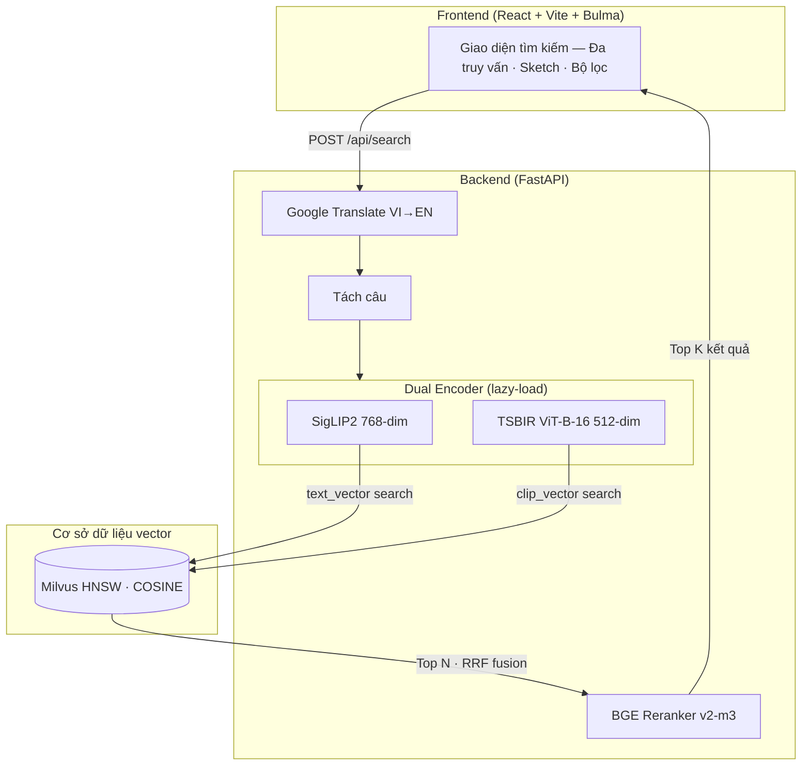
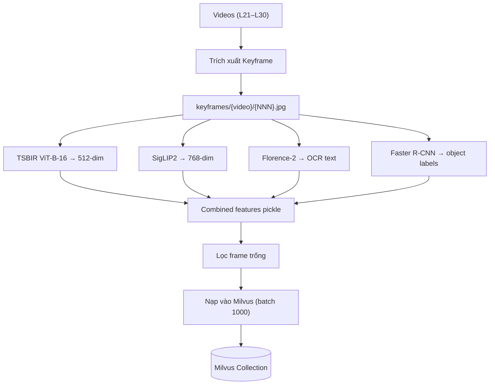
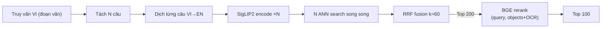
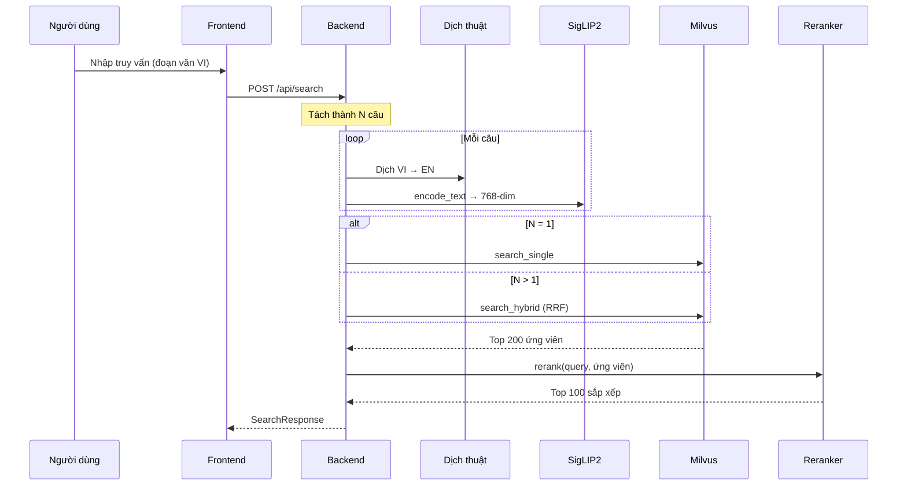

# Hệ thống truy xuất sự kiện video dựa trên biểu diễn đa phương thức — AIC 2025

**Nhóm:** UIT-MMRAG
**Thành viên:** Trang Kỳ Anh (250101006), Lê Nguyễn Bảo Hân (250101017), Đặng Anh Đạt (250101009)
**GVHD:** TS. Phạm Đỗ Kim Chi
**Trường:** Đại học Công Nghệ Thông Tin — ĐHQG TP.HCM

---

## 1. Giới thiệu

Báo cáo này trình bày hệ thống truy xuất sự kiện video đa phương thức cho cuộc thi AI Challenge 2025 (AIC 2025). Bài toán Known-Item Search (KIS): cho một truy vấn bằng tiếng Việt dạng đoạn văn nhiều câu, tìm đúng keyframe trong tập dữ liệu video tin tức lớn.

Hệ thống sử dụng kiến trúc **hai tầng (two-tier)**:
- **Tầng 1 — Truy xuất dense:** Dual encoder (SigLIP2 cho truy vấn text, TSBIR ViT-B-16 cho sketch) kết hợp tách câu và hợp nhất Reciprocal Rank Fusion (RRF).
- **Tầng 2 — Xếp hạng lại:** Cross-encoder BGE-reranker-v2-m3 đánh giá cặp (query, objects + OCR text).

Tính đa phương thức thể hiện ở hai mức: **phía dữ liệu** — index visual embeddings, OCR text (Florence-2), và object labels (Faster R-CNN) cho mỗi keyframe; **phía truy vấn** — hỗ trợ text query (tiếng Việt, tự động dịch sang Anh) và sketch query.

## 2. Tập dữ liệu

### 2.1 Nguồn dữ liệu

Tập dữ liệu gồm keyframes trích xuất từ **10 batch video** (L21–L30) của AIC 2025. Mỗi batch chứa nhiều video, mỗi video được biểu diễn bằng chuỗi keyframes lấy tại các scene change.

### 2.2 Trường dữ liệu mỗi keyframe

| Trường | Kiểu | Mô tả |
|---|---|---|
| `video_name` | string | Định danh video (vd: `L25_V049`) |
| `keyframe_idx` | int | Số thứ tự keyframe trong video |
| `frame_idx` | int | Số frame thực trong video gốc |
| `pts_time` | float | Thời điểm hiển thị (giây) |
| `fps` | float | Tốc độ khung hình |
| `clip_vector` | float[512] | Embedding TSBIR ViT-B-16 (sketch-dense) |
| `text_vector` | float[768] | Embedding SigLIP2 (text-dense) |
| `objects` | string[] | Nhãn đối tượng Faster R-CNN (conf ≥ 0.3, tối đa 20) |
| `ocr` | string | Văn bản OCR từ Florence-2 |

### 2.3 Các loại truy vấn

Cuộc thi cung cấp 24 truy vấn tiếng Việt:

| Loại | Số lượng | Mô tả |
|---|---|---|
| KIS (Known-Item Search) | 18 | Tìm keyframe khớp mô tả cảnh cụ thể |
| QA (Question Answering) | 3 | Trả lời câu hỏi bằng cách tìm keyframe chứa đáp án |
| TRAKE | 3 | Theo dõi sự kiện thời gian trong video |

Chúng tôi đánh giá trên KIS + QA (21 truy vấn). TRAKE yêu cầu lý luận thời gian vượt quá khả năng single-frame retrieval.

**Ví dụ truy vấn KIS (đoạn văn nhiều câu):**
> *"Đây là phần giới thiệu việc phóng tàu vũ trụ tư nhân. Đoạn clip bắt đầu với hình ảnh 4 phi hành gia mặc áo đen. Một trong những nhiệm vụ dự kiến của tàu vũ trụ là nghiên cứu ánh sáng cực quang ở vùng cực."*

Đoạn văn này được tách thành 3 câu, mỗi câu được encode độc lập và hợp nhất qua RRF.

### 2.4 Thống kê

| Chỉ số | Giá trị |
|---|---|
| Tổng video | 873 |
| Tổng keyframes | 177.321 |
| Trung bình keyframes/video | ~203 |
| Chiều vector | 512 (TSBIR) + 768 (SigLIP2) |
| Số lớp đối tượng | 80 (COCO-style) |

### 2.5 Tiền xử lý

Trong quá trình nạp dữ liệu, các frame trống (transition) được lọc bỏ: frame có mean pixel > 220 và std < 30 (gần trắng) hoặc mean < 15 và std < 10 (gần đen) bị loại vì không chứa nội dung ngữ nghĩa.

## 3. Kiến trúc hệ thống

Hệ thống gồm ba lớp: frontend React cho tương tác tìm kiếm, backend FastAPI với các mô hình ML lazy-load, và cơ sở dữ liệu vector Milvus.



*Sơ đồ đầy đủ: [docs/diagrams/architecture.mmd](diagrams/architecture.mmd)*

### 3.1 Các mô hình sử dụng

| Thành phần | Mô hình | Chiều / Params | Mục đích |
|---|---|---|---|
| Text Encoder (chính) | `google/siglip2-base-patch16-512` | 768-dim | Encode truy vấn text → không gian `text_vector` |
| Sketch Encoder | TSBIR ViT-B-16 (`open_clip` + checkpoint) | 512-dim | Encode sketch/ảnh → không gian `clip_vector` |
| Reranker | `BAAI/bge-reranker-v2-m3` | 568M | Cross-encoder scoring (query, objects+OCR) |
| OCR | `microsoft/Florence-2-base` | — | Trích xuất văn bản từ keyframe (offline) |
| Object Detection | `faster_rcnn/inception_resnet_v2` (OpenImagesV4) | — | Phát hiện đối tượng (offline, tối đa 20 nhãn) |
| Dịch thuật | Google Translate API | — | Dịch truy vấn Việt → Anh |

**Thiết kế dual-encoder:** Chỉ một encoder chiếm GPU tại một thời điểm. SigLIP2 là mặc định cho text query (768-dim, trường `text_vector`). TSBIR ViT-B-16 kích hoạt khi có sketch query (512-dim, trường `clip_vector`). Chuyển đổi qua `POST /api/switch-encoder` trigger unload model hiện tại và lazy-load model mới.

**Tại sao chọn các mô hình này?** SigLIP2 dùng sigmoid loss thay vì contrastive loss, cho text-image alignment tốt hơn CLIP cho retrieval. TSBIR ViT-B-16 được fine-tune chuyên cho text-sketch-based image retrieval. BGE-reranker-v2-m3 là cross-encoder đa ngôn ngữ, có thể scoring trên text Việt-Anh hỗn hợp.

### 3.2 Pipeline dữ liệu offline



*Sơ đồ đầy đủ: [docs/diagrams/data-pipeline.mmd](diagrams/data-pipeline.mmd)*

Bốn bộ trích xuất đặc trưng chạy song song trên mỗi keyframe. Kết quả gộp thành file pickle và nạp vào Milvus theo batch 1000. Cả hai trường vector được index bằng HNSW (M=32, efConstruction=256, metric=COSINE).

### 3.3 Schema Milvus

| Trường | Kiểu | Index |
|---|---|---|
| `id` (PK) | VARCHAR(32) | — |
| `video_name` | VARCHAR(16) | — |
| `keyframe_idx` | INT32 | — |
| `frame_idx` | INT64 | — |
| `pts_time`, `fps` | FLOAT | — |
| `clip_vector` | FLOAT_VECTOR(512) | HNSW (M=32, ef=256, COSINE) |
| `text_vector` | FLOAT_VECTOR(768) | HNSW (M=32, ef=256, COSINE) |
| `objects` | ARRAY\<VARCHAR\>(max 20) | — |
| `ocr` | VARCHAR(4096) | — |

### 3.4 Pipeline truy xuất hai tầng



*Sơ đồ đầy đủ: [docs/diagrams/two-tier.mmd](diagrams/two-tier.mmd)*

**Tầng 1 — Truy xuất dense với tách câu:**
Mỗi đoạn truy vấn được tách thành N câu tại dấu chấm và xuống dòng. Mỗi câu được dịch VI→EN rồi encode thành vector 768-dim bằng SigLIP2. Milvus thực hiện N lần ANN search song song trên trường `text_vector` và hợp nhất kết quả bằng RRF:

$$\text{RRF}(d) = \sum_{i=1}^{N} \frac{1}{k + \text{rank}_i(d)}$$

với k=60. Điều này cho phép các câu khác nhau match các khía cạnh thị giác khác nhau của keyframe mục tiêu, cải thiện recall so với single-vector search.

**Tầng 2 — Xếp hạng lại bằng cross-encoder:**
Top 200 ứng viên từ Tầng 1 được BGE cross-encoder đánh giá lại. Với mỗi ứng viên, text document = `objects_joined + " " + ocr_text`. Cross-encoder cho ra điểm relevance cho mỗi cặp (query, document), top 100 được trả về.

### 3.5 Luồng xử lý truy vấn



*Sơ đồ đầy đủ: [docs/diagrams/search-sequence.mmd](diagrams/search-sequence.mmd)*

## 4. Phương pháp đánh giá

### 4.1 Phương pháp tính điểm của cuộc thi

AIC 2025 sử dụng **Mean of Top-k R-Scores** làm metric chính. Mỗi truy vấn cho phép nộp tối đa 100 câu trả lời xếp hạng. Cách tính:

**Bước 1 — R-Score cho từng câu trả lời.** Mỗi câu trả lời $r_i$ tại vị trí $i$ được chấm điểm:

- **Với truy vấn Textual-KIS:** Câu trả lời gồm (video_name, frame_idx). R-Score:

$$\text{R-Score}(r_i) = \mathbb{1}(v_i = GT_v \;\wedge\; id_i \in [s, e])$$

  Câu trả lời đúng (score = 1) khi và chỉ khi tên video khớp **và** frame index nằm trong khoảng chấp nhận [s, e].

- **Với truy vấn Visual QA:** Câu trả lời gồm (video_name, frame_idx, answer_text). R-Score yêu cầu thêm answer text khớp ground truth:

$$\text{R-Score}(r_i) = \mathbb{1}(v_i = GT_v \;\wedge\; id_i \in [s, e] \;\wedge\; a_i = GT_a)$$

**Bước 2 — Best-in-top-k.** Với mỗi ngưỡng $k \in \{1, 5, 20, 50, 100\}$, lấy R-Score cao nhất trong top $k$ câu trả lời:

$$\text{Best}@k = \max_{1 \le i \le k} \text{R-Score}(r_i)$$

Nếu câu trả lời đúng xuất hiện ở bất kỳ vị trí nào trong top-k, hệ thống được điểm tối đa cho ngưỡng đó. Thiết kế này có ý nghĩa: dataset có thể chứa video trùng hoặc gần trùng, nên cùng một truy vấn có thể match nhiều video hợp lệ. Cuộc thi thưởng cho hệ thống đưa được đáp án đúng vào top-k, dù không phải top-1.

**Bước 3 — Điểm cuối cùng.** Trung bình Best@k qua 5 ngưỡng:

$$\text{Final Score} = \frac{1}{5} \sum_{k \in \{1,5,20,50,100\}} \text{Best}@k$$

Điểm tối đa 1.0 = đáp án đúng luôn ở vị trí 1. Điểm 0.6 = đáp án đúng xuất hiện từ vị trí 3 trở đi (được điểm cho k≥5 nhưng không cho k=1).

**Metric phụ:**
- **Recall@k** — tỷ lệ truy vấn có ít nhất 1 kết quả đúng trong top k
- **MRR** (Mean Reciprocal Rank) — trung bình $1/\text{rank}$ của kết quả đúng đầu tiên

### 4.2 Xây dựng Ground Truth

Cuộc thi không công bố ground truth cho tập truy vấn luyện tập, nên chúng tôi tự xây dựng theo quy trình **search-assisted annotation kết hợp anti-contamination**.

#### Công cụ annotation

Chúng tôi phát triển công cụ annotation dạng web (`create_gt.py`) chạy trên `localhost:8501`, gồm:

- **Sidebar** liệt kê 21 truy vấn (18 KIS + 3 QA)
- **Panel tìm kiếm** proxy đến backend API, trả về top-50 ứng viên với ảnh thumbnail
- **Chế độ browse thủ công** khi kết quả đúng không nằm trong top search
- **Nút lưu** ghi annotation vào `eval/ground_truth.json`

#### Quy trình annotation

1. **Tìm kiếm:** Annotator chọn truy vấn, nhấn "Search" để lấy top-50 ứng viên từ SigLIP2 + rerank. Ứng viên hiển thị dạng grid thumbnail kèm điểm.

2. **Chọn frame đúng:** Annotator click vào keyframe chính xác. Nếu không có trong ứng viên, browse thủ công theo video.

3. **Frame range:** Khi chọn, tự động đặt vùng chấp nhận: $[\text{frame\_idx} - 30, \text{frame\_idx} + 30]$. Điều này tính đến sai lệch sampling — frame mà truy vấn mô tả có thể không nằm đúng tại keyframe boundary, nhưng keyframe lân cận chứa cùng cảnh.

4. **Viết lại truy vấn (anti-contamination):** Annotator viết `eval_query` — mô tả ngữ nghĩa tương đương nhưng **khác từ ngữ**, viết **sau khi đã thấy frame đúng**. Script đánh giá dùng `eval_query` thay vì query gốc, đảm bảo hệ thống được test trên text chưa từng encode. Không có bước này, đánh giá sẽ bị bias vì query gốc đã ảnh hưởng đến quá trình indexing.

5. **Lưu:** Mỗi entry có schema:
```json
{
  "query_id": "query-p1-1-kis",
  "query_type": "KIS",
  "query": "truy vấn gốc từ cuộc thi",
  "eval_query": "mô tả viết lại sau khi thấy frame",
  "video_name": "L25_V049",
  "frame_idx": 1050,
  "frame_range": [1020, 1080],
  "lang": "vi"
}
```

#### Sinh ứng viên hàng loạt

Để tăng tốc annotation, chúng tôi xây dựng `prefill_gt.py`:
1. Đọc 21 file truy vấn
2. Tách mỗi truy vấn thành các câu (ranh giới câu tiếng Việt)
3. Tìm kiếm qua API với tách câu + multi-query RRF + rerank
4. Lưu top-10 ứng viên mỗi truy vấn vào `eval/gt_candidates.json`
5. Annotator review và chọn ứng viên đúng

### 4.3 Pipeline đánh giá

Script đánh giá (`evaluate.py`) cài đặt đúng công thức tính điểm của cuộc thi:

1. Đọc ground truth từ `eval/ground_truth.json`
2. Với mỗi entry, dùng `eval_query` (fallback sang `query` nếu không có)
3. **Tách** truy vấn thành các câu tại dấu chấm/xuống dòng
4. Gửi multi-query đến `POST /api/search` với RRF fusion
5. Tính R-Score cho mỗi kết quả (khớp video_name + frame_range)
6. Tính Mean Top-k R-Score, Recall@k, và MRR
7. Xuất báo cáo per-query với hit rank, latency, và top-1 info

### 4.4 Siêu tham số

| Tham số | Giá trị | Ghi chú |
|---|---|---|
| `top_k` | 100 | Tối đa kết quả cho submission |
| `rerank_candidates` | 200 | Tầng 1 trả 200 cho reranking |
| `rrf_k` | 60 | Tham số điều hòa RRF |
| `metric_type` | COSINE | Cả hai HNSW index |
| `ef` (search) | 512 | Hệ số mở rộng HNSW |
| `use_fp16` (reranker) | True | BGE inference nửa chính xác |
| `frame_range tolerance` | ±30 | Vùng chấp nhận frame ground truth |

## 5. Kết quả

### 5.1 Kết quả chính

<!-- TODO: Điền sau khi chạy evaluation -->

| Cấu hình | TopK-R ↑ | MRR ↑ | R@1 | R@5 | R@20 | R@50 | R@100 |
|---|---|---|---|---|---|---|---|
| SigLIP2 + Tách câu + Rerank | [TODO] | [TODO] | [TODO] | [TODO] | [TODO] | [TODO] | [TODO] |
| SigLIP2 + Tách câu (không rerank) | [TODO] | [TODO] | [TODO] | [TODO] | [TODO] | [TODO] | [TODO] |

### 5.2 Phân tích per-query

<!-- TODO: Điền từ eval/results.json -->

| Query ID | Loại | Số câu | Điểm | Hit Rank | Top-1 Video |
|---|---|---|---|---|---|
| [TODO] | [TODO] | [TODO] | [TODO] | [TODO] | [TODO] |

### 5.3 Phân tích

<!-- TODO: Điền sau đánh giá -->

**Hiệu quả tách câu:** Truy vấn nhiều câu được hưởng lợi từ decomposition vì mỗi câu có thể match độc lập một khía cạnh thị giác khác nhau. Truy vấn mô tả "4 phi hành gia mặc đen" và "nghiên cứu cực quang" có thể tìm đúng frame qua một câu dù câu kia match kém.

**Hiệu quả reranking:** Cross-encoder có quyền truy cập OCR text (Florence-2) và object labels — thông tin bi-encoder không dùng trực tiếp trong retrieval. Đặc biệt hữu ích cho QA queries tham chiếu text nhìn thấy trong frame (vd: tên CLB "FANA").

## 6. Ablation Study

### 6.1 Số lượng ứng viên rerank (N)

Bao nhiêu ứng viên Tầng 1 nên đưa vào reranker?

| N (rerank_candidates) | TopK-R ↑ | Latency |
|---|---|---|
| 50 | [TODO] | ~3s |
| 100 | [TODO] | ~6s |
| 200 | [TODO] | ~12s |

**Đánh đổi:** N lớn hơn cải thiện recall nhưng tăng latency tuyến tính. Mặc định N=200.

### 6.2 Text representation cho reranker

| Candidate Text | Mô tả |
|---|---|
| Objects + OCR (hiện tại) | Nhãn đối tượng + Florence-2 OCR text |
| Chỉ Objects | Nhãn đối tượng, không có OCR |

OCR text đặc biệt quan trọng cho QA queries tham chiếu text nhìn thấy (biển hiệu, logo kênh).

### 6.3 So sánh encoder

| Encoder | Chiều | TopK-R ↑ | Ghi chú |
|---|---|---|---|
| SigLIP2 (chính) | 768 | [TODO] | Tối ưu cho text, chiều cao hơn |
| TSBIR ViT-B-16 | 512 | [TODO] | Tối ưu cho sketch/ảnh |

SigLIP2 dự kiến vượt trội TSBIR cho text queries nhờ tập huấn luyện text-image lớn hơn và cơ chế patch-level attention.

## 7. Phân tích lỗi

### 7.1 Các loại lỗi

| Loại | Mô tả | Ví dụ |
|---|---|---|
| **Khoảng cách ngữ nghĩa** | Embedding không nắm bắt mô tả cảnh phức tạp | Query mô tả hành động; encoder match diện mạo thị giác |
| **Chất lượng OCR** | Florence-2 đọc sai text tiếng Việt | Mất dấu tiếng Việt, text nhỏ không đọc được |
| **Mất mát dịch thuật** | Dịch VI→EN mất sắc thái | Tiếng lóng, thuật ngữ chuyên ngành |
| **Truy vấn thời gian** | Query tham chiếu sự kiện thời gian | TRAKE: "khoảnh khắc khi..." |

### 7.2 Case Studies

**Case 1: KIS — Phóng tàu vũ trụ (query-p1-1)**
> *Query:* "Đây là phần giới thiệu việc phóng tàu vũ trụ tư nhân. Đoạn clip bắt đầu với hình ảnh 4 phi hành gia mặc áo đen."
> *Tách câu:* 3 câu → 3 SigLIP2 vectors → RRF fusion

- **Kết quả:** [TODO: top-1 video, frame, score, hit rank]
- **Phân tích:** [TODO: Tách câu có giúp? Reranking có thay đổi thứ hạng?]

**Case 2: QA — Tên câu lạc bộ từ thiện (query-p1-15)**
> *Query:* "Đoạn video về một chương trình từ thiện của một câu lạc bộ tên là FANA..."

- **Phân tích:** QA query này yêu cầu đọc text từ frame. Florence-2 OCR trích xuất "FANA", BGE reranker match với query. OCR filter cũng cho phép lọc trực tiếp.
- [TODO: Reranking hỗ trợ OCR có tìm đúng frame?]

**Case 3: TRAKE — Múa lân (query-p1-16)**
> TRAKE queries định nghĩa nhiều sự kiện thời gian trong một video. Frame-level retrieval không thể nắm bắt ranh giới sự kiện — đây là hạn chế kiến trúc.

## 8. Hạn chế và hướng phát triển

1. **Reranker chỉ thấy text:** BGE scoring dựa trên object labels + OCR, không thấy pixel ảnh. Image captioning (BLIP-2, LLaVA) sẽ cung cấp text proxy phong phú hơn.

2. **Chất lượng OCR tiếng Việt:** Florence-2 không được train trên tiếng Việt. OCR chuyên biệt (VietOCR, PaddleOCR) có thể cải thiện QA.

3. **Lý luận thời gian:** TRAKE queries cần video-level temporal grounding.

4. **Tăng tốc GPU:** BGE reranking trên CPU mất ~12s cho 200 ứng viên. GPU (FP16) giảm xuống <1s.

5. **Encoder đa ngôn ngữ:** Encoder multilingual sẽ tránh lỗi dịch VI→EN.

6. **Encoder lớn hơn:** SigLIP2-base có thể nâng cấp lên SigLIP2-large.

## 9. Kết luận

Chúng tôi xây dựng hệ thống truy xuất video đa phương thức hai tầng cho AIC 2025:
- **Dual-encoder** dense retrieval (SigLIP2 cho text, TSBIR cho sketch)
- **Tách câu + RRF fusion** cho truy vấn đoạn văn nhiều câu
- **Cross-encoder reranking** kết hợp object labels + OCR text (BGE-reranker-v2-m3)
- **Index đa phương thức**: visual embeddings, Florence-2 OCR, Faster R-CNN objects

Phát hiện chính:
- [TODO: Cấu hình tốt nhất và TopK-R score]
- [TODO: Tác động tách câu với truy vấn nhiều câu]
- [TODO: Tác động reranking — đặc biệt với QA queries có OCR]
- [TODO: Các loại lỗi chính và tần suất]

Hệ thống được triển khai dạng web application với frontend React và backend FastAPI, hỗ trợ tìm kiếm tương tác, chuyển đổi encoder real-time, sketch input, và các tham số tìm kiếm có thể cấu hình.

## Tài liệu tham khảo

1. Zhai, X., et al. (2023). "Sigmoid Loss for Language Image Pre-Training." *ICCV 2023*. (SigLIP/SigLIP2)
2. Chen, J., et al. (2024). "BGE M3-Embedding: Multi-Lingual, Multi-Functionality, Multi-Granularity Text Embeddings Through Self-Knowledge Distillation." *arXiv:2402.03216*. (BGE Reranker)
3. Cormack, G., et al. (2009). "Reciprocal Rank Fusion outperforms Condorcet and individual Rank Learning Methods." *SIGIR 2009*. (RRF)
4. Radford, A., et al. (2021). "Learning Transferable Visual Models From Natural Language Supervision." *ICML 2021*. (CLIP/OpenCLIP)
5. Xiao, B., et al. (2024). "Florence-2: Advancing a Unified Representation for a Variety of Vision Tasks." *CVPR 2024*. (Florence-2)
6. Huang, Z., et al. (2017). "Speed/Accuracy Trade-Offs for Modern Convolutional Object Detectors." *CVPR 2017*. (Faster R-CNN)
7. Milvus Documentation. https://milvus.io/docs
